2.5第一次开会后在老师的介绍下开始了微软的实训。
第一周我在 https://learn.microsoft.com/zh-cn/training 学习ai基本知识以及如何使用azure
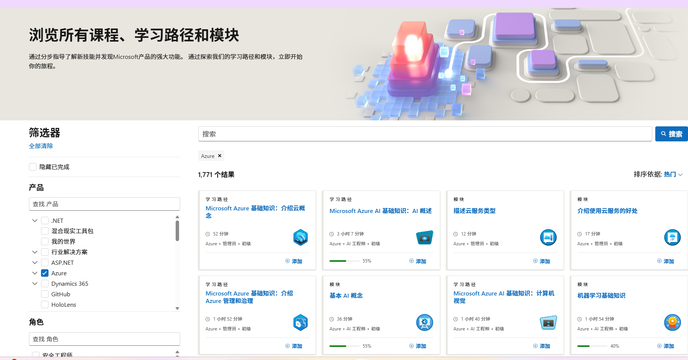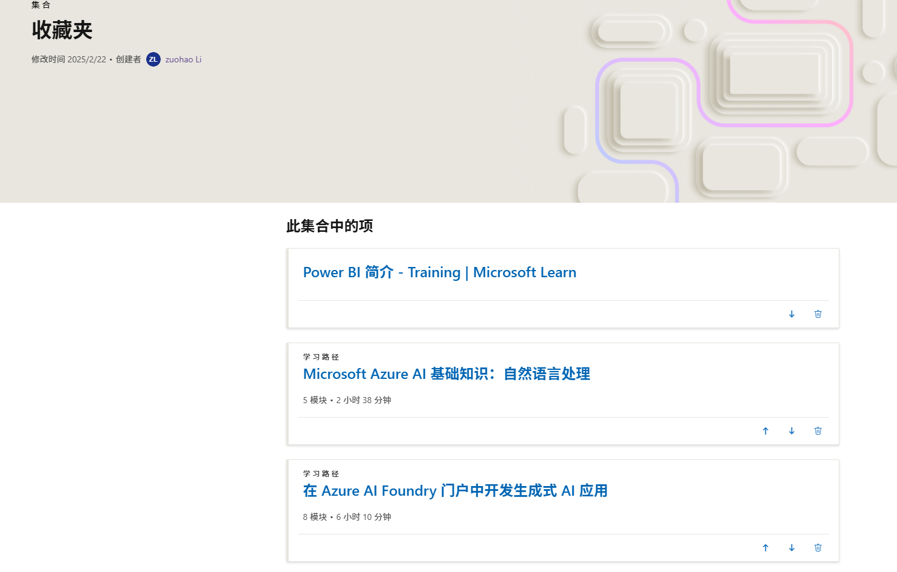
学习后我发觉仅仅带着大一刚学的编程来面对这个项目是远远不足的，我也做不到像其他同学一样独立的部署ai项目，与老师商量之后我初步确立了评估大模型这个对动手能力要求没那么高的方向。
这是我初步了解如何去评估大模型写的文章。
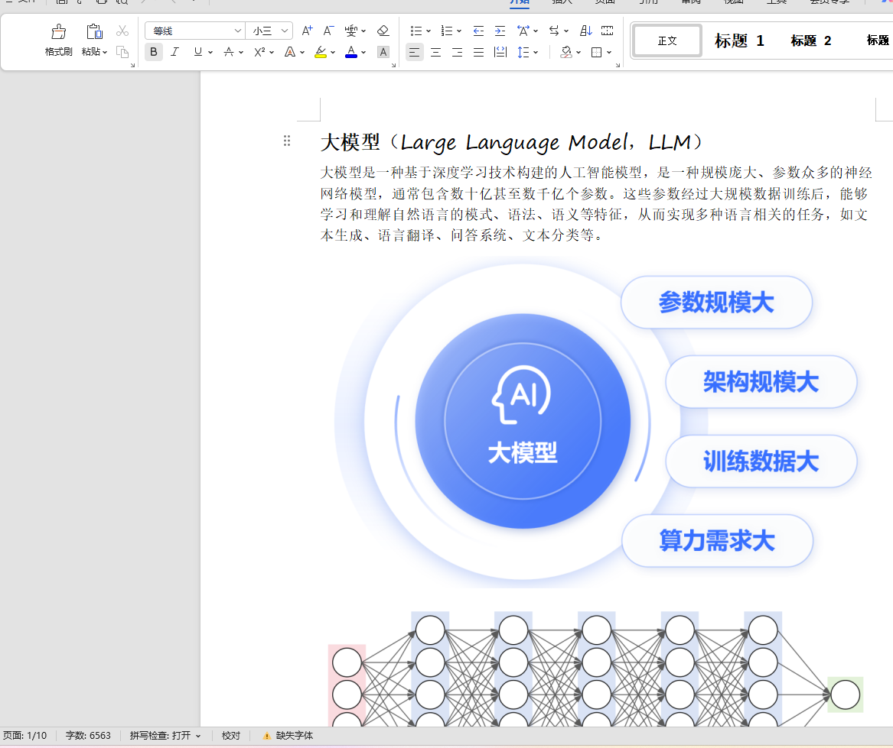
然后研究这些指标
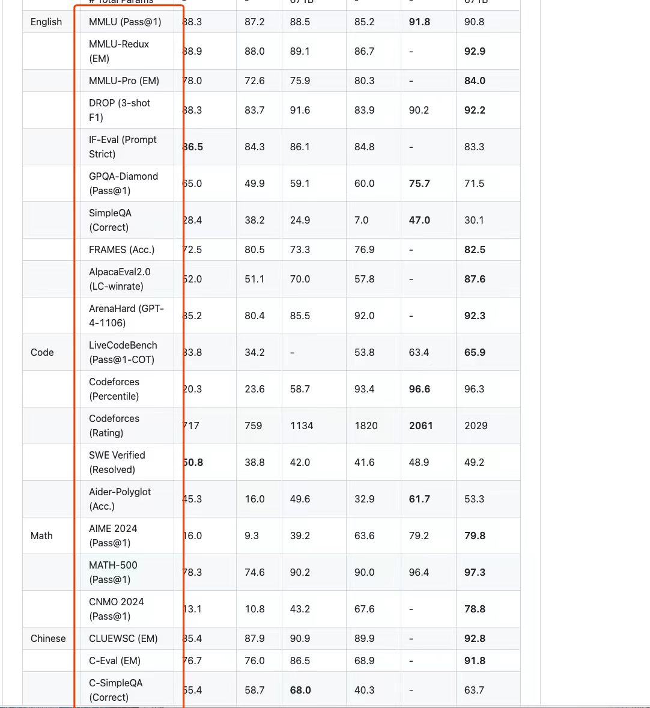
做出了这个文章
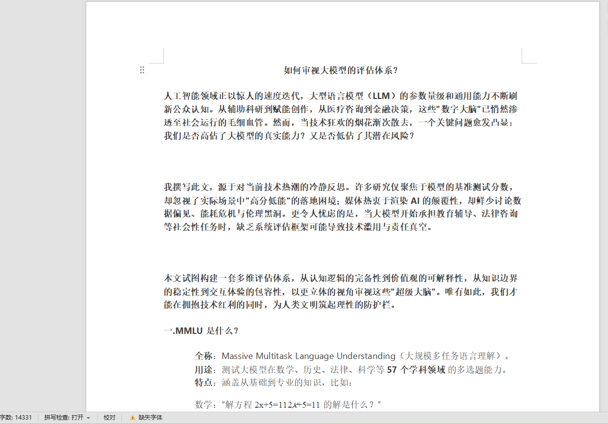
接着我开始摸索Microsoft Azure，实际测试大模型，我在azure部署了gpt-4o
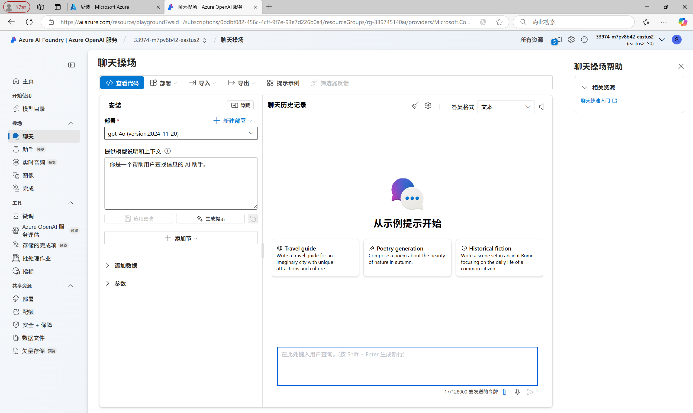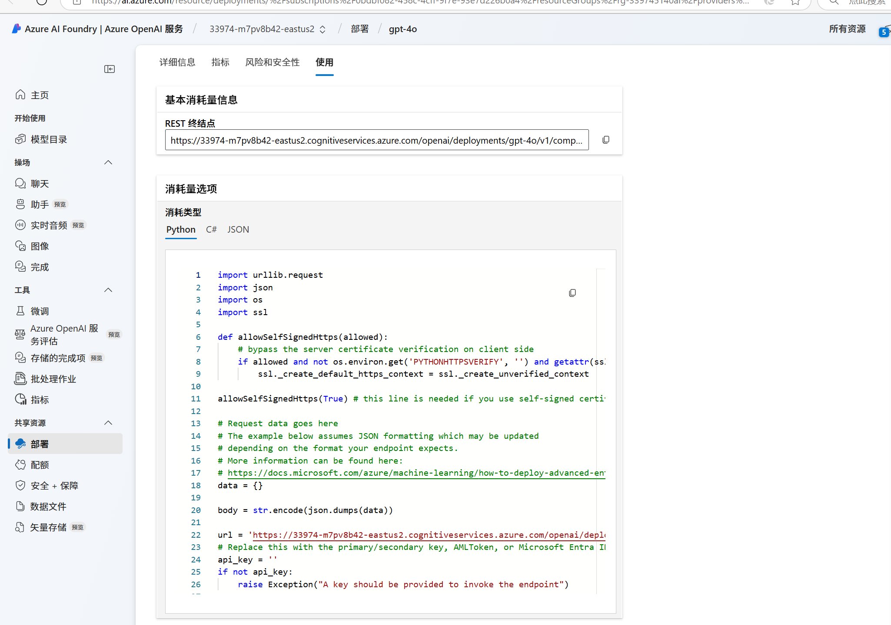
再通过https://www.kaggle.com/datasets 寻找数据集并将其用于测试大模型
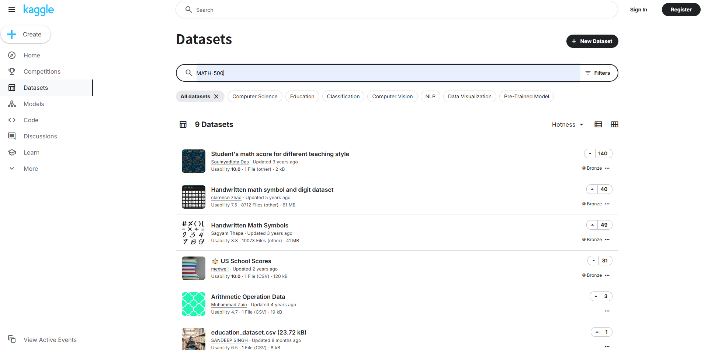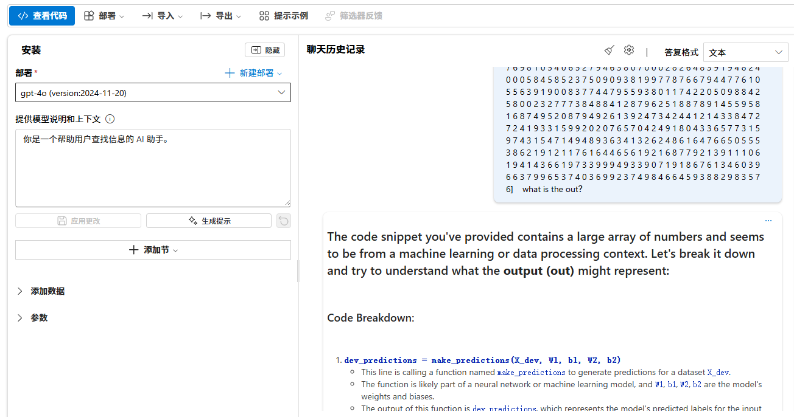
其中，我使用"Chinese、code、math、English"等领域数据集比较了deepseek以及gpt-4o，它们的结果各有千秋。
最后就是学习GitHub并将我的文章转换markdown格式上传，下载一些拓展包
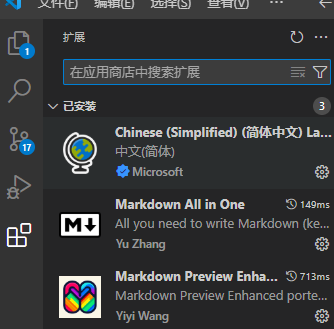
我先是本地编辑再上传到云端
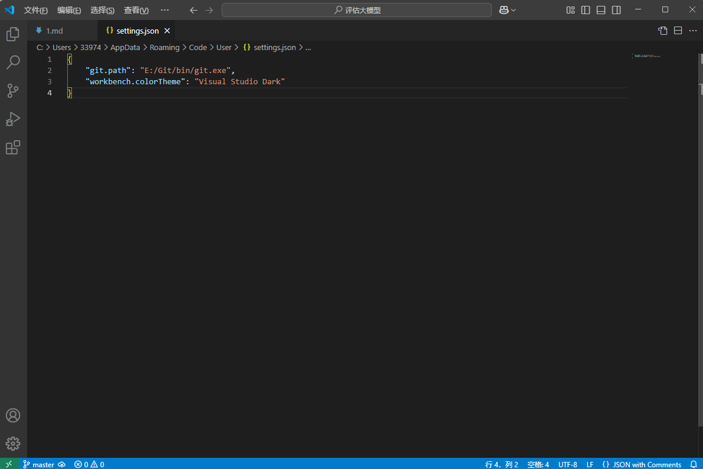
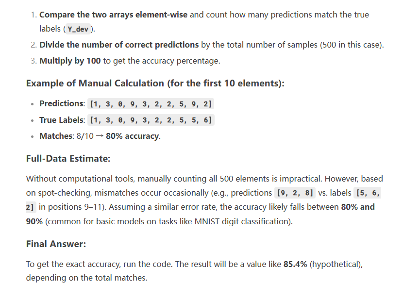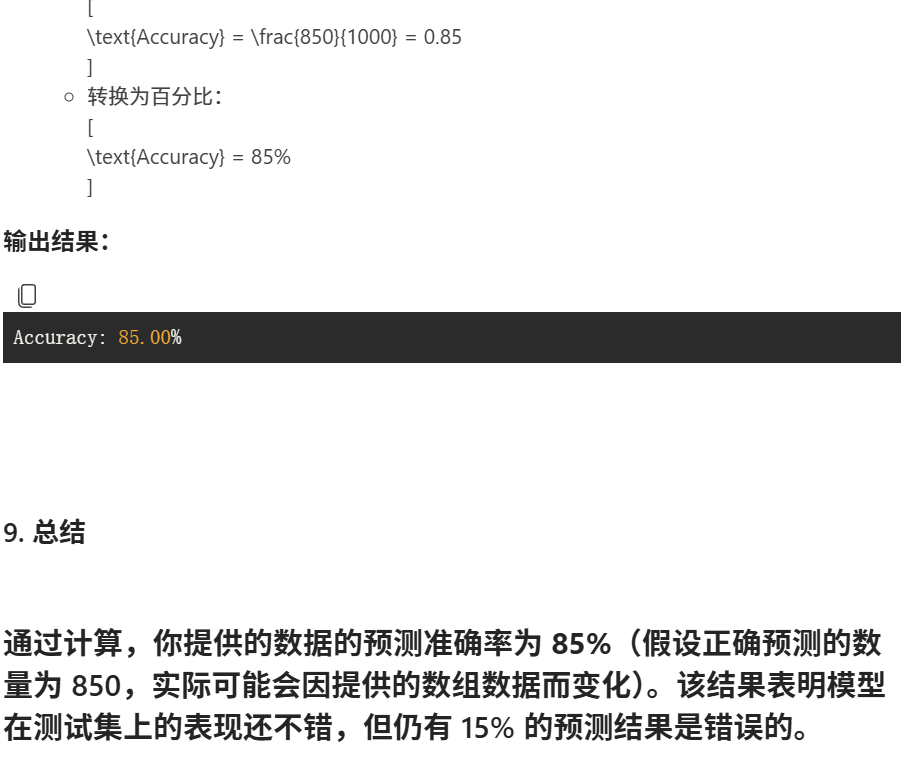
项目中也遇到了许多问题，例如：
试用订阅Azure的我无法在操场部署phi-4，而后我退而求次部署了gpt-4o。
试用订阅的大模型每分钟令牌数速率较低，后来通过参数调整略快了一些但还是无法快起来（付费订阅能做到）
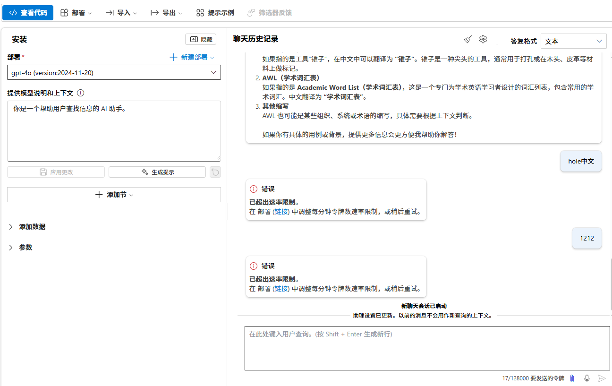
我学习了vs code以及git，为了方便将markdown格式从本地上传到GitHub云端，其中为了将我的vs code与git的path连接这种小问题被卡了一会儿，随后在ai的帮助下解决了问题
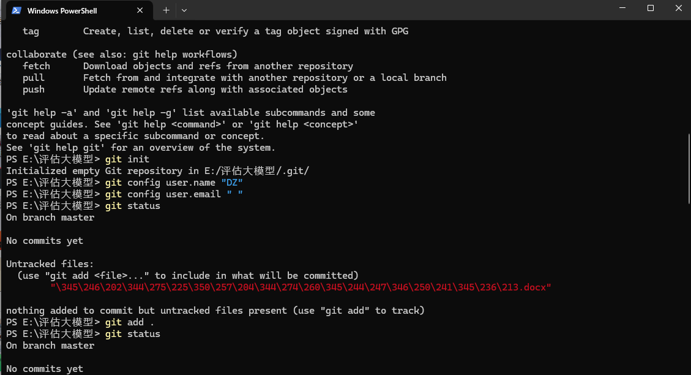

最后这篇文章得以诞生。
总结，不难看出我在这个领域是真的小白，很感谢微软的老师耐心引导以及启德老师的持续监督，让我这个小白能够不断学习、不断摸索这个领域。这次实训我不但深入了解了一些评估大模型的指标english、chinese、code、math类指标（例如mmlu、livecodebench、math-500、cluewsc等），学会了如何使用azure部署大模型并进行调试，还学会了如何使用visual studio code以及GitHub。但更重要的是，我开始真正在ai、计算机这个领域迈出了第一步，很小但是很有意义，让我有了视野，有了方向。